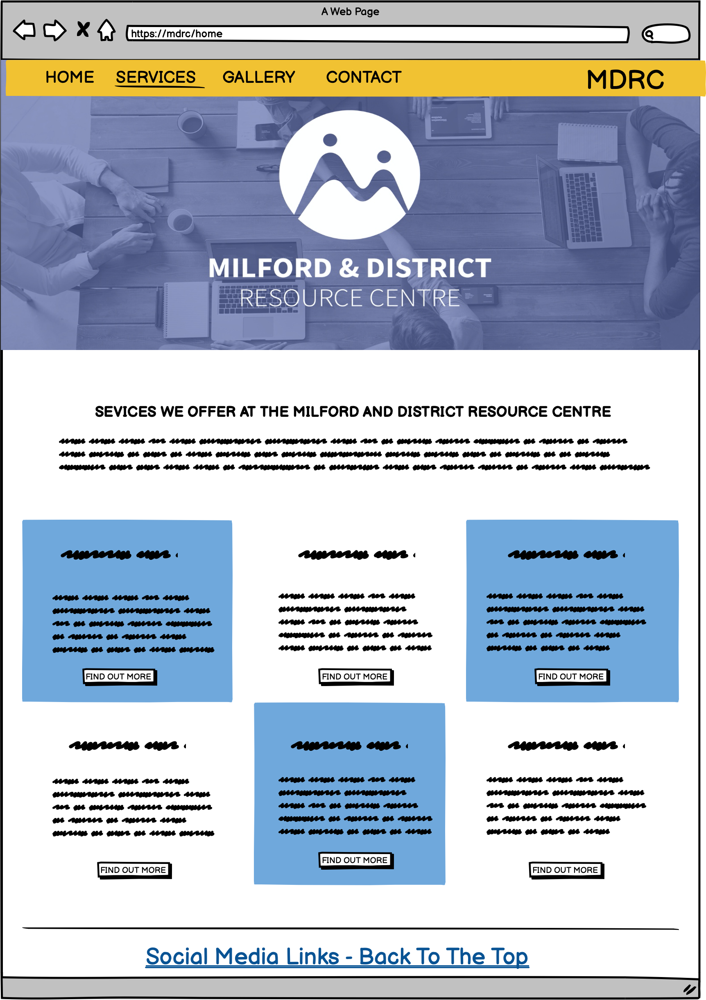
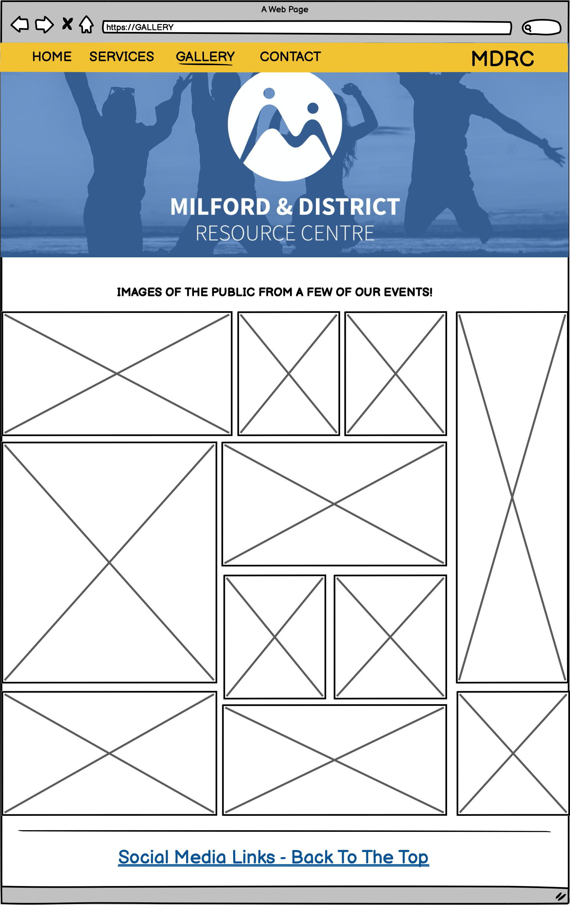
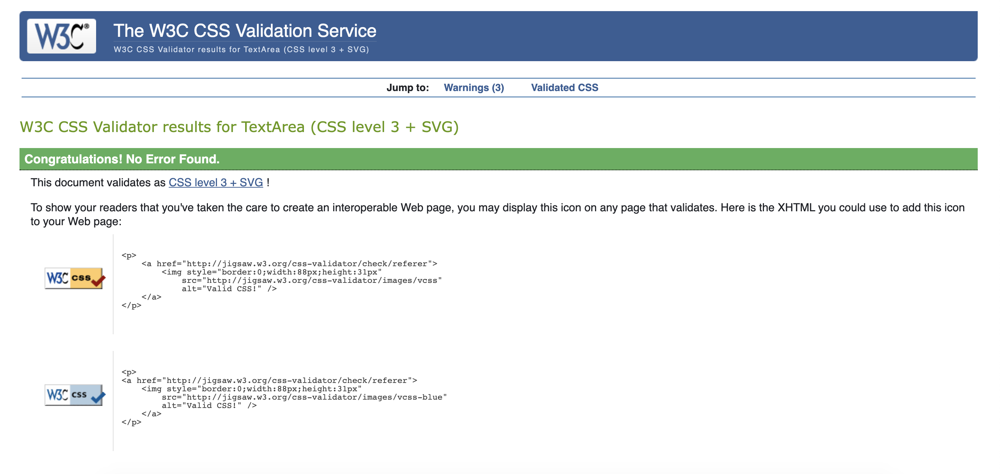

 
 
 

 <h1>PROJECT 1: THE MILFORD AND DISTRICT RESOURCE CENTRE WEBSITE </h1>

The MDRC website is a website for the company Milford and District Resource Centre (MDRC). The company itself is a central hub of community services that are offerd the local community of Milford. The site owner's (MDRC) goal of the site is for the site to be a public source of information regarding the services the resource centre has to offer. The external's user's goal is to learn more about the services offered to them by the resource centre and to be able to ask for more information about the services through the website. I chose this company to work with as I am their in-house graphic designer and recognised their need for a website.
 

<h2><strong>Project Goals:</strong></h2>
<h3><strong>User Goals</strong></h3>
<ul>
    <li>Finding what <strong>services are availbale</strong> to them (the members of the local community) in their local community.
    </li>
    <li>Be able to read a detailed summary of services available, and <strong>when and where</strong> they are on.</li>
    <li>Find <strong>contact information</strong> for the resource centre to learn more about services</li>
    <li>Find the <strong>location</strong> of the centre</li>
</ul>

<h3><strong>Site Owner's Goals:</strong></h3>
    <ul>
    <li> Increase traffic to the website.</li>
    <li> Increase profits from sales of services in the office through increased promotion of them through the website.</li>
    <li> Increased public awarness of services offered to the public.</li>
    <li> Offer a direct point of contact to new or current customers from the website.</li>
    </ul>

<h2><strong>User Experience:</strong></h2>
<h3> <strong>Target Audience </strong> </h3>

 The target audience for this site is quite broad. The centre itself offers printing, graphic design, bookeeping, social prescribing, room rental, and support for the over 65's. On the daily, the centre would have members of the public from varied backgrounds, technical abilities and age groups. 

<h3><strong>User Requirements</strong></h3>

As I have mentioned, we have a very large/ varied target audience, and becasue of this the site has to be simple in design and very accessible. They way I have tackled this are as follows:

<ul>
    <li>Simple navigation that is non-ambiguous</li>
    <li>Have skimmable text in paragraphs so that users can easily and quickly find what they are looking for.</li>
    <li>Simple presentation of content on the page that make logical sense. </li>
    <li>A functional responsive wesite that allow the user to view the site regardless of screen size. </li>
    <li>A straightforward and professional form that allows users to easily contact the business.</li>
</ul>

<h3><strong>User Stories</strong></h3>
<h3><strong>First time and Recurring Stories</strong></h3>
<ol>
    <li>As a user, I want to be able to view the services that I can avail of in my local community.</li>
    <li>As a user, I want to know where I can get a avail of printing in my area.</li>
    <li>As a user with the view of visting the office, I want to know exactly where it is located.</li>
    <li>As a user who not tech savy, I want to be able to read, understand and navigate an easy and understandable website.</li>
        <li>As a user who doesn't understand websites, I want to easily find a phone number for the office so I can contact them.
    </li>
    <li>As a user who owns a local business, I want to contact them get a quote for the price of business cards.</li>
</ol>

<h3><strong>Site's Owner Stories</strong></h3>
<ol>
    <li>As the owner of the site, I want my potential customers to have a place where they can view the services I offer. </li>
    <li>As the owner, I want to have an online platform that can be a hub of information for the locals in the area.</li>
    <li>As the owner, I want a website that is accessible to anyone.</li>
    <li>As the owner, I want a site that will encourage my customers to use the services we have to offer.</li>
    <li> As the owner, I want a site that will have the potential to be built upon in the future.</li>
    <li> As the owner, I want the customers to easily locate the company.</li>
</ol>

<h2><strong>Design:</strong></h2>
<h3><strong>Design Choices</strong></h3>

 The company itself is a company with a wide target audience, and with this in mind I wanted to create a site that was accessible to everyone regardless of their technical ability, and ability to operate a computer. I wanted all designs to be simplistic, the navigation to be logical and seamless and for the accessibility to be a primary concern. 

<h3><strong>Colour</strong></h3>

  
The color scheme that I have used throughout the website is taken directly from the brand guidelines that were available to be as a member of the organisation. To verfiy the contrast in colours were accessible I tested them on WebAIM which they all passed as readable. 

Colours and Brand Guidelines

  

  <h3><strong>Fonts</strong></h3>
  
Fonts used on the website were Open Sans Bold and Open Sans Light. Open sans bold was used for headings and open sans light was used in paragraphs.

  <h3><strong>Structure</strong></h3>

The strucutre of this website was designed to be easily navagated through and easy to learn. I made sure that each page followed a similar structure but didn't comprimise the content that each page held. The following pages are within the structure of the site:

<ul>
<li> A home Page = Basic information about the site, with an image of the building and a meet the team section.</li>
<li> A Services page = The services page offers an overview of the services offered by the resource center. </li>
<li> A gallery page = Offers the user a chance to see possible familiar faces taking part in local activites/ meetings.    This page aims to encourage the user to want to partake in the activites/ events themselves.</li>
<li> A Contact Page = Gives the user contact information and a google maps view of where the building is. There is also a contact form for a user to use to contact the comapny.</li>

<h3><strong>Wireframes</strong></h3>

The wireframes included have evolved and changed since I originally drew them up over a week ago. This is due to the limitations of my skills thus far developed and changes I have made personally to the look of the site when building it.

 Home Page

 Services Page

 Gallery Page

Contact Page

<h2><strong>Technology:</strong></h2>
<h3><strong>Develpoment Languages Used</strong></h3>

<ul>
<li> HTML5 </li>
<li> CSS </li>
</ul>

<h3><strong>Frameworks and Tools Used</strong></h3>
<ul>
<li> Bootstrap  </li>
<li> Git, GitHUb, and GitPod </li>
<li> Balsamiq </li>
<li> Google Fonts </li>
<li> Font Awesome </li>
<li> Google Developer Tools (for responsive site)</li>
</ul>

<h2><strong>Features:</strong></h2>
<h3><strong>Home Page</strong></h3>
<h4>Navigation Bar</h4>
    <ul>
        <li>The navigation bar is featured on all four of the pages that make up the website. The navigation bar includes links to the Home Page, the Services Page, the Gallery Page and the Contact Page, and also the logo that re-directs you to the home page. The navigation bar is identical on each page to allow for easy navigation for each of the users. The design of the navigation bar is simple to limit ambiguity with the user. </li>
        <li> The main purpose of the navigation bar in the site is to allow the user easy travel through the site without the need of a previous or back button. </li>
        <li> The navigation will also be responsive across all devices, which will also serve to the accessibilty of the site do a myriad of users.
    </ul>
    <h4>Welcome Section</h4>
    <ul>
    <li>The welcome section of the site offers a quick introduction to the company. </li>
    <li> It also include an image of the building so the office is easily identifiable and eay to locate.</li>
    </ul>
    <h4>Meet the Team Section</h4>
     <ul>
     <li>
     Also featured on the main page is a meet the team section which shows the user who they can expect to see when they visit the office.  </li>
     <li> The meet the team section also goes into detail of what each person work as and what they can help you with.
     </li></ul>
     <h4>Footer</h4>
     <ul>
     <li> The footer allows the user to contact and view the social media pages that the organisation have.</li>
     <li> The social media links comprise of the respective social network icons for easy accessibility.</li>
    <h3><strong>Services Page</strong></h3>
    <h4>Services Features (Contact us for more button)</h4>
    <ul>
    <li> The services page is very plane. It features a grid style list of services that the resource center provides with a button to redirect the user to the contact page in a new tab.</li>
    </ul>
    <h3><strong>Gallery Page</strong></h3>
    <h4>Gallery grid</h4>
    <ul>
    <li>The gallery page features a grid of photos taken of the local community.</li></ul>
    <h3><strong>Contact Page </strong></h3>
    <h4>Google Maps Feature and Contact Form</h4>
    <ul>
    <li>The coantact page offers the user a chance to view the location of the office in the Milford Area on Google Maps. </li>
    <li> The contact form offers the users to message the office to ask about a certain service, or inquire about general queries easily and directly.</li></ul>
     

<h2><strong>Testing:</strong></h2>
<h3><strong>HTML Validation</strong></h3>

 To Validate my HTML I used the W3C Markup Validation Service. All HTML passed its Validation with no errors but a few warnings as shown below in the pictures.

Home page

Services page

Gallery page

Contact page

<h3><strong>CSS Validation</strong></h3>

 To Validate my CSS, I used the W3C Jigsaw CSS Validation Service. All CSS passed its Validation.

CSS

<h3><strong>Accessibility Test and Performance</strong></h3>

 To Validate my accessibility, I used the Lighthouse evaluation tool in developer tools. My site was awarded the following: 

Home page

Services page
 

Gallery page

Contact page

<h2><strong>Performance</strong></h2>

The site was tested on the following decives:

<ol>
<li>MacBook Pro</li>
<li>iPhone 6/7/8</li>
<li>iPad (Regular size)</li>
</ol>

 The site was also tested on the following browsers

<ol>
<li>Google Chrome</li>
<li>Safari</li>
<li>Firefox</li>
</ol>

<h2><strong>Bugs:</strong></h2>

<h2><strong>Deployment:</strong></h2>

In order to deploy my site I took the following steps using GitHub pages:

<ol>
<li>In the GitHub repository, select the "Settings" tab at the top of the page.</li>
<li> Then on the left hand-side in the menu, select "Pages".</li>
<li> The where it says source, used the dropdown menu to select "Main".</li>
<li> After a few moments, refresh the website and you should have a pop-up come up to tell you that "Your site has been published" with your link coming after.</li>
</ol>

 My link is: https://megannyhan.github.io/CI_PP1_MDRC/ 

<h2><strong>Credits:</strong></h2>

 Images not li nked and referenced below were designed and taken by the author.

<h3> Site Images:</h3>
<ul>

<li>https://www.pexels.com/photo/woman-smiling-and-holding-teal-book-1181424/ Photo by Christina Morillo from Pexels</li>

<li> https://pbs.twimg.com/profile_banners/1442473373020213248/1632836293/1500x500 Designed by Declan Meehan featured on Twitter</li>

<li> Google Maps Link: https://www.google.com/maps/place/Milford+%26+District+Resource+Centre/@55.0895701,-7.6994824,15z/data=!4m2!3m1!1s0x0:0x1295c52d66ece440?sa=X&ved=2ahUKEwjz_M3qvPzzAhWSSsAKHQfTAC0Q_BJ6BAhcEAU Designed by Google maps</li>

<li>https://www.pexels.com/photo/gray-and-black-laptop-computer-2764666/ Photo by Oleg Magni from Pexels </li>

<li>https://thisismilford.com/wp-content/uploads/2020/02/mdrc10166-1024x768.jpg photo by Declan Meehan on MDRC.ie</li>
</ul>
Gallery Images:

<ul>
<li>https://www.pexels.com/photo/unrecognizable-man-surfing-on-surfboard-in-ocean-7952882/ Photo by Инна Работягина from Pexels </li>

<li>https://www.pexels.com/photo/fit-woman-practicing-yoga-in-studio-7593192/ Photo by Miriam Alonso from Pexels </li>

<li> https://www.pexels.com/photo/couple-sitting-on-the-wooden-floor-7648357/ Photo by Artem Podrez from Pexels</li>

<li>https://www.pexels.com/photo/positive-woman-in-boxing-gloves-7991649/ Photo by Annushka Ahuja from Pexels </li>

<li>https://www.pexels.com/photo/multiethnic-couple-of-travelers-with-backpacks-7968269/ Photo by George Pak from Pexels </li>

<li>https://www.pexels.com/photo/a-cyclist-holding-his-bicycle-5836952/ Photo by RODNAE Productions from Pexels </li>

<li>https://www.pexels.com/photo/crop-ethnic-psychologist-writing-on-clipboard-during-session-5699456/ Photo by Alex Green from Pexels</li>

<li>https://www.pexels.com/photo/photo-of-man-sitting-in-front-of-people-3184299/ Photo by fauxels from Pexels </li>

<li>https://www.pexels.com/photo/group-of-multiethnic-people-gathering-around-female-speaker-in-studio-3856027/Photo by Matheus Bertelli from Pexels</li>

<li>https://www.pexels.com/photo/women-sitting-on-chairs-inside-a-room-3719037/ Photo by Dani Hart from Pexels</li>

<li>https://www.pexels.com/photo/food-man-people-woman-6591166/ Photo by cottonbro from Pexels</li>

<li>https://www.pexels.com/photo/ground-group-growth-hands-461049/ Photo by Pixabay from Pexels</li>

</ul>

<h3> Source Code Used in Site</h3>

 Due to limitations in my knowledge I google certain code that I wanted to use for the site, see code listed below:

<ul>
<li> The meet the team code (both HTML and CSS) was taken from the following site: https://www.w3schools.com/howto/ howto_css_images_side_by_side.asp </li>

<li> The map code was taken from the following code: https://stackoverflow.com/questions/5756440/aligning-google-map-with-text </li>

<li> Code to help with the contact form was taken from bootstrap: https://getbootstrap.com/docs/5.1/forms/form-control/ </li>

<li>I also referenced the Love-Running project to help with the grid for the Gallery Section, the social links from the footer and the contact form. It was not copied and pasted directly but it was used for help so I thought I would mention it.</li></ul>

<h2><strong>Acknowledgements:</strong></h2>

 I would like to take this oppurtuinity to thank and acknowlege the following people:
<ul>
<li> I would like to thank Mo Shami - my mentor - for his feedback and guidence whilst creating the project.</li>
<li> I would like to thank those on the code institute slack channel for help with any issues I had.</li>
<li> I would like to thank my manager who helped me with Site Owner's stories to help guide the creation and purpose of the site.</li>
</ul>

